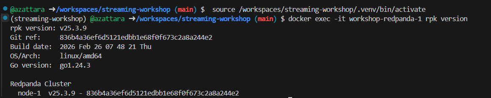
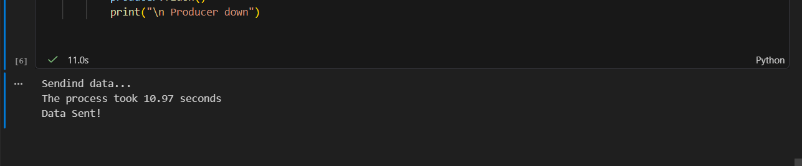
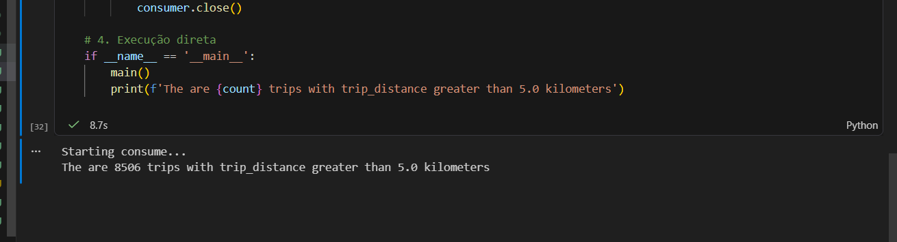

# Homework

## Question 1. Redpanda version

After running `docker exec -it workshop-redpanda-1 rpk version` , the version of Redpanda is v25.3.9.


## Question 2. Sending data to Redpanda

We create a topic called green-trips using the follwing comand `docker exec -it workshop-redpanda-1 rpk topic create green-trips`, the we crete a producer to send the green taxi data to this topic usinng the file [`homework_producer.ipynb`](https://github.com/azattara/Data-Engineering-Zoomcamp-2026/blob/main/Homework%207%20Streaming/notebook/homework_producer.ipynb). The process was executed and the closest answer from the set of suggested answers is 10 seconds.




## Question 3. Consumer - trip distance

To answer how many trips have a trip_distance greater than 5.0 kilometers we create execute the script  [`homework_producer.ipynb`](https://github.com/azattara/Data-Engineering-Zoomcamp-2026/blob/main/Homework%207%20Streaming/notebook/homework_producer.ipynb) . The answer is 8506.


## Question 4. Tumbling window - pickup location
We create the Flink Job [`aggregated_pickup_job.py`](https://github.com/azattara/streaming-workshop/blob/main/src/jobs/aggregated_pickup_job.py) who reads from green-trips and uses a 5-minute tumbling window to count trips per PULocationID

After we execute this query: 
```sql
SELECT PULocationID, num_trips
FROM aggregated_pickup
ORDER BY num_trips DESC
LIMIT 3;
```

the `PULocationID` with the most trips in a single 5-minute window is 74.

## Question 5. Session window - longest streak
We create the Flink Job [`longest_streak_job.py`](https://github.com/azattara/streaming-workshop/blob/main/src/jobs/longest_streak_job.py)

After processing all the events with the job, this query:

```sql
SELECT window_start, window_end, PULocationID, num_trips
FROM aggregated_longest_streak
ORDER BY num_trips DESC
LIMIT 3;
```
we find that, the longest streak was one of 81 rides.

## Question 6. Tumbling window - largest tip
We create the Flink Job [`aggregated_tips_per_hour_job`](https://github.com/azattara/streaming-workshop/blob/main/src/jobs/aggregated_tips_per_hour_job.py)
Then we execute the query:

```sql
SELECT *
FROM aggregated_tips_per_hour
ORDER BY total_tips DESC
LIMIT 5;
```

 Who retuned the hour with the highest total tip amount: 2025-10-16 18:00:00.


