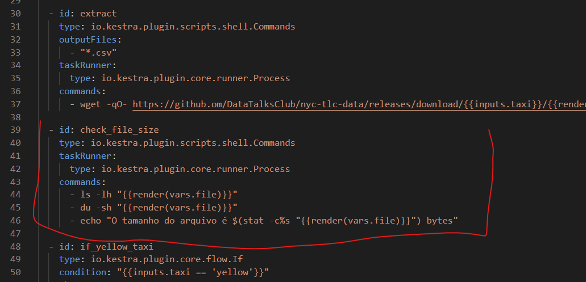
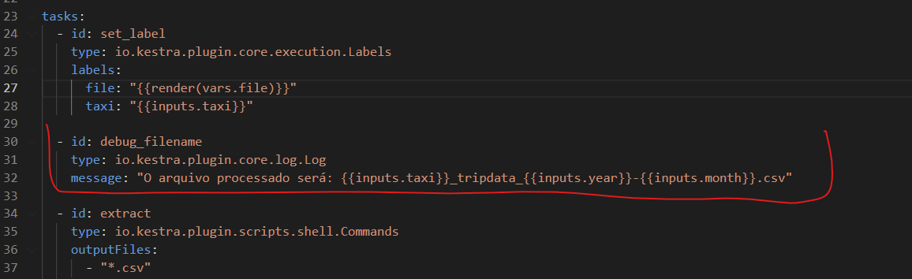
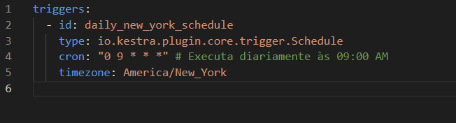

## Question 1. Within the execution for Yellow Taxi data for the year 2020 and month 12: what is the uncompressed file size (i.e., the output file yellow_tripdata_2020-12.csv of the extract task)?

To find out the size of the uncompressed file within Kestra without having to download it manually, you can add a Shell Commands task right after extraction.

The image below shows the size log task that was added to the YAML:

After execution, the size response is 128.3 MiB.

## Question 2. What is the rendered value of the variable file when the inputs taxi is set to green, year is set to 2020, and month is set to 04 during execution? (1 point)

To answer this, an explicit Log was added to the YAML, as shown in the image below:

After that, we confirmed that the answer is:

filename = 'green_tripdata_2020-04.csv'

The answer is: 'green_tripdata_2020-04.csv'

## Question 3. How many rows are there for the Yellow Taxi data for all CSV files in the year 2020?

To find the answer, we executed the following query on the database containing the Yellow Taxi information:

The result is 24,648,499 rows.

## Question 4. How many rows are there for the Green Taxi data for all CSV files in the year 2020?

To find the answer, we executed the following query on the database containing the Green Taxi information (All 2020 Files):

The result is 1,734,051 rows.

## Question 5. How many rows are there for the Yellow Taxi data for the March 2021 CSV file?

To find the answer, we executed the following query on the database containing the Yellow Taxi data for the March 2021:

The result is 1,925,152 rows.

## Question 6. How would you configure the timezone to New York in a Schedule trigger?

To set the time zone to New York in a scheduling trigger in Kestra, we must add the `timezone` property directly to the trigger definition. For this, the block shown in the figure below was added to the triggers section of the YAML file.

