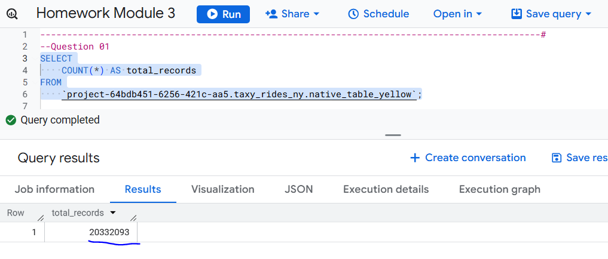
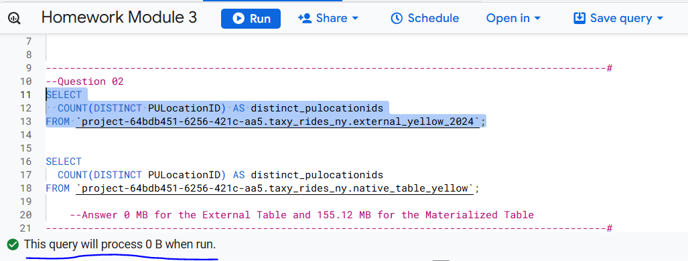
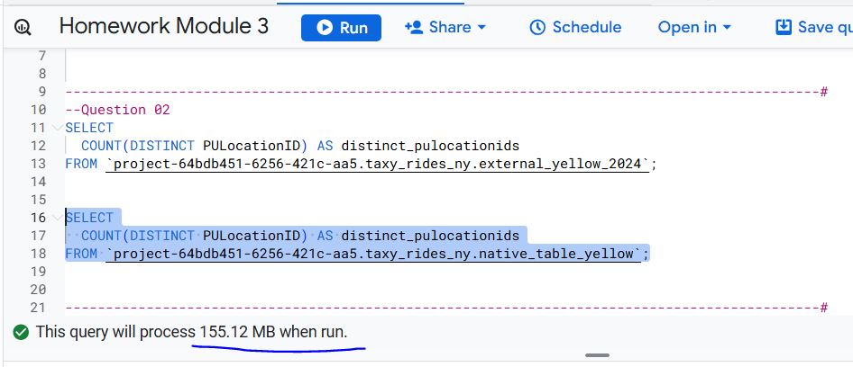
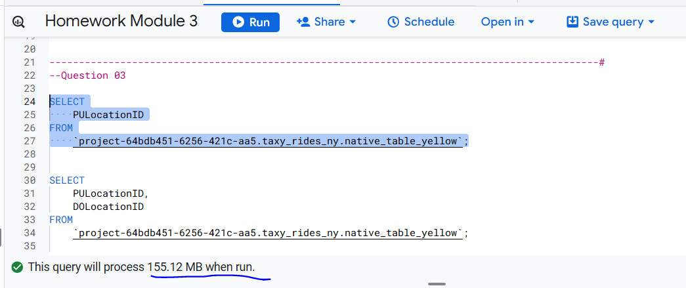
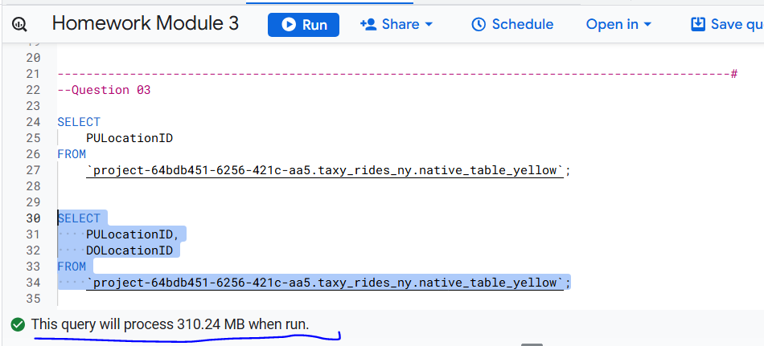
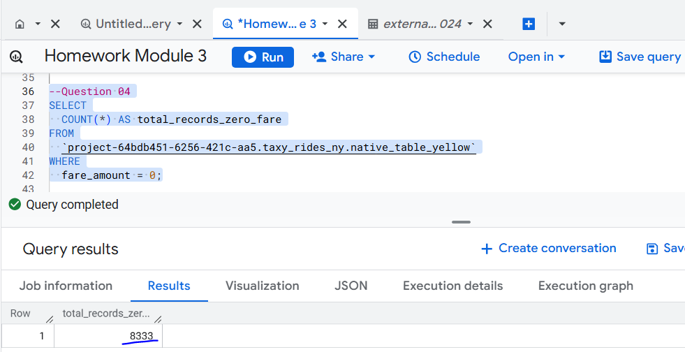
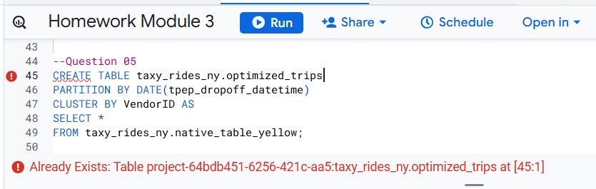
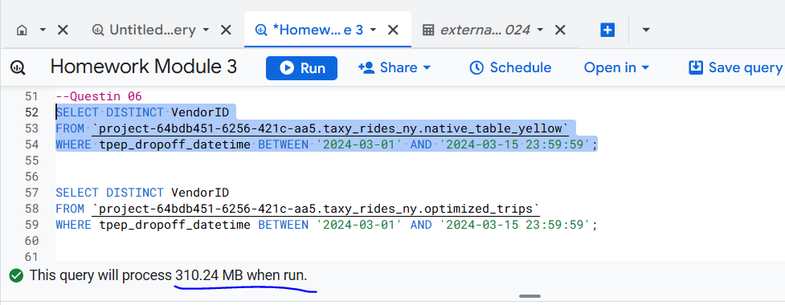
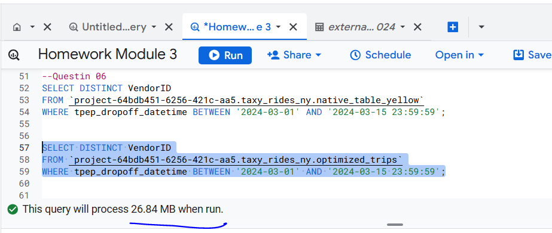

## Question 1 What is count of records for the 2024 Yellow Taxi Data?

The image below shows the count of records for the 2024 Yellow Taxi Data:

## Question 2. Write a query to count the distinct number of PULocationIDs for the entire dataset on both the tables.
## What is the estimated amount of data that will be read when this query is executed on the External Table and the Table?

The image below shows the estimated amount of data that will be read when this query is executed on the External Table and the Table:

## Question 3. Write a query to retrieve the PULocationID from the table (not the external table) in BigQuery. Now write a query to retrieve the PULocationID and DOLocationID on the same table. Why are the estimated number of Bytes different?

The image below shows the estimated number of Bytes from the materialized table to retrieve the PULocationID and  to retrieve the PULocationID and DOLocationID:

## Question 4. How many records have a fare_amount of 0?

The image below how many records have a fare_amount of 0:

## Question 5. What is the best strategy to make an optimized table in Big Query if your query will always filter based on tpep_dropoff_datetime and order the results by VendorID (Create a new table with this strategy)?

The image below shows the query to create the optimized table:

## Question 6. Write a query to retrieve the distinct VendorIDs between tpep_dropoff_datetime 2024-03-01 and 2024-03-15 (inclusive). Use the materialized table you created earlier in your from clause and note the estimated bytes. Now change the table in the from clause to the partitioned table you created for question 5 and note the estimated bytes processed. What are these values?

The image below shows the query and the estimated bytes processed to retrieve the distinct VendorIDs between tpep_dropoff_datetime 2024-03-01 and 2024-03-15 from the materialized table and the partitioned table created for question 5:

## Question 7. Where is the data stored in the External Table you created?

The data in External Table is not stored inside BigQuery. It stays in its original location, typically Google Cloud Storage (GCS) (most common) (e.g. a bucket with Parquet/CSV/JSON files).

## Question 8. It is best practice in Big Query to always cluster your data?

False, clustering should be applied only when it aligns with your query patterns and provides a clear performance or cost benefit.

## Question 9. Write a `SELECT count(*)` query FROM the materialized table you created. How many bytes does it estimate will be read? Why?

The estimated bytes processed is zero because BigQuery can answer this query using metadata only. For native (materialized) BigQuery tables, BigQuery stores the row count as table metadata.
