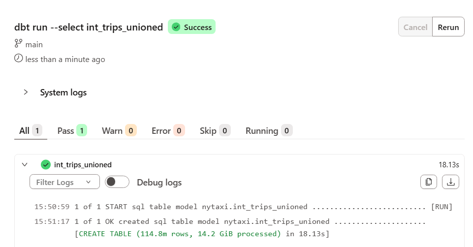
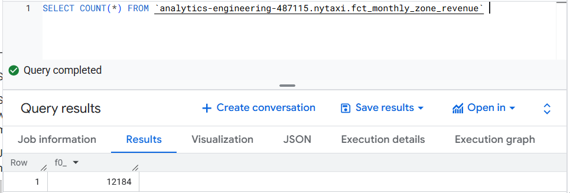
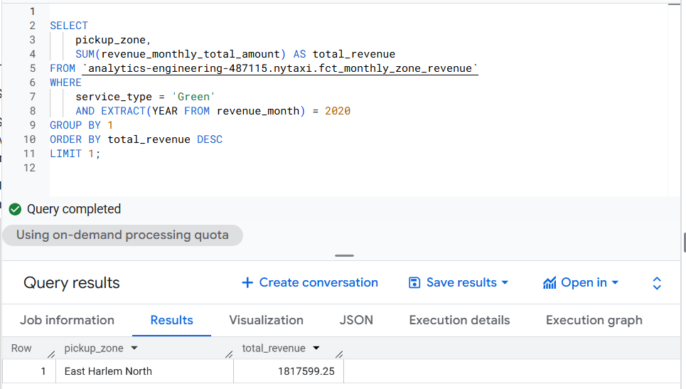
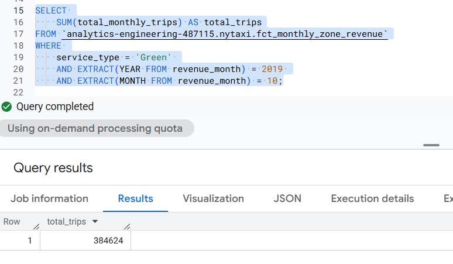
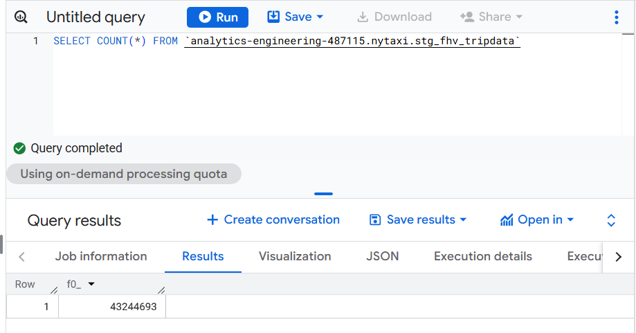

## Question 1.  If you run dbt run --select int_trips_unioned, what models will be built?

The image below shows which models is build,when I run dbt run --select int_trips_unioned:

## Question 2. New value 6 appears in payment_type. What happens on dbt test?

The answer is: dbt fails the test with non-zero exit code.

## Question 3. After running your dbt project, query the fct_monthly_zone_revenue model.
## What is the count of records in the fct_monthly_zone_revenue model?

The image below shows the count of records in the fct_monthly_zone_revenue model:

## Question 4. Using the fct_monthly_zone_revenue table, find the pickup zone with the highest total revenue (revenue_monthly_total_amount) for Green taxi trips in 2020.
## Which zone had the highest revenue?

The image below shows which zone had the highest revenue:

## Question 5. Using the fct_monthly_zone_revenue table, what is the total number of trips (total_monthly_trips) for Green taxis in October 2019?

The image below shows the total number of trips (total_monthly_trips) for Green taxis in October 2019:

## Question 6. After Create a staging model stg_fhv_tripdata with these requirements:
## - Filter out records where dispatching_base_num IS NULL
## - Rename fields to match your project's naming conventions (e.g., PUlocationID → pickup_location_id)
## What is the count of records in stg_fhv_tripdata?

The image below shows the count of records in stg_fhv_tripdata

