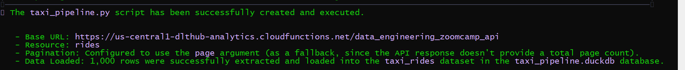
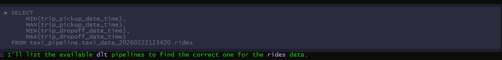
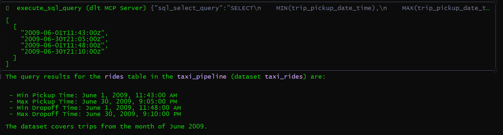
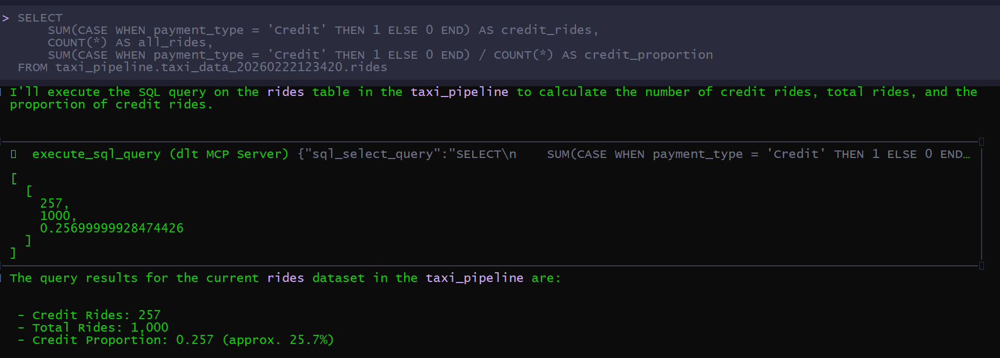
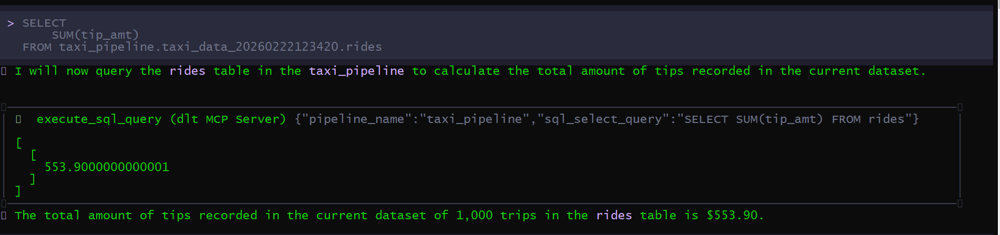

## Setup Instructions

The project was created and initialized with this snippet:

```bash
mkdir taxi-pipeline
cd taxi-pipeline

uv init --python 3.11 --directory .
uv add "dlt[workspace]"
uv run dlt init dlthub:taxi_pipeline duckdb
gemini mcp add dlt -- uv run --with "dlt[duckdb]" --with "dlt-mcp[search]" python -m dlt_mcp
```
The image below shows teh configuration of the pipeline using gemini cli:




## Question 1. What is the start date and end date of the dataset?

The answer is:- **2009-06-01 to 2009-07-01**.




## Question 2. What proportion of trips are paid with credit card?

The answer is:- **26.66%** approximately.


## Question 3. What is the total amount of money generated in tips?


