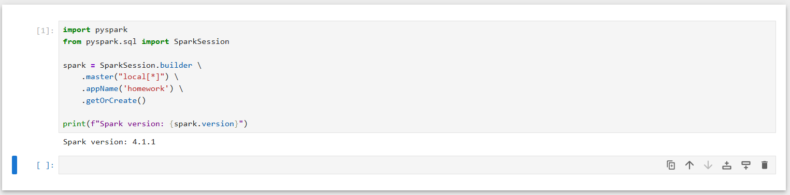
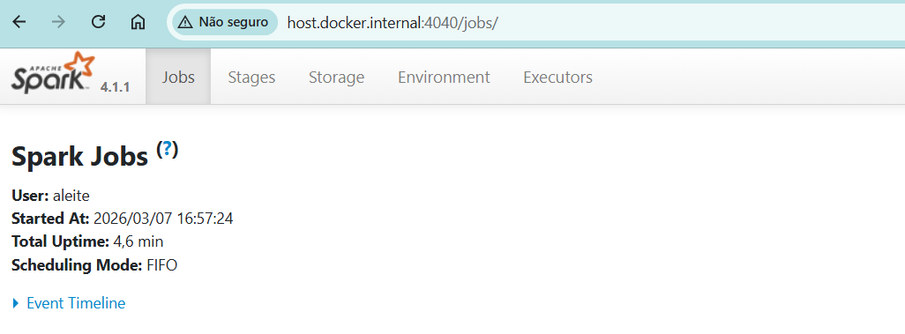

# Module 6 Homework

## Question 1: Install Spark and PySpark

> Install PySpark follow this [guide](https://github.com/DataTalksClub/data-engineering-zoomcamp/blob/main/06-batch/setup/)
> - Install Spark
> - Run PySpark
> - Create a local spark session
> - Execute spark.version.
> What's the output?



## Question 2: Yellow November 2025

> Read the November 2025 Yellow into a Spark Dataframe.
>
> Repartition the Dataframe to 4 partitions and save it to parquet.
>
> What is the average size of the Parquet (ending with .parquet extension) Files that were created (in MB)?
>
> The average size is **25MB**.
>
> ## Question 3: Count records

> How many taxi trips were there on the 15th of November?
>
> Consider only trips that started on the 15th of November.

```python
from pyspark.sql import functions as F

df_trips = df_trips.withColumn('pickup_date', F.to_date(df_trips.tpep_pickup_datetime))
df_trips.filter(df_trips.pickup_date == '2025-11-15').count()
```

```
162604
```

The number of trips started on the 15th of November is:

- **162,604**

- ## Question 4: Longest trip

> What is the length of the longest trip in the dataset in hours?

- 22.7
- 58.2
- 90.6
- 134.5

```python
from pyspark.sql import types
from datetime import datetime

def duration(start: datetime, end: datetime) -> int:
    # Difference in minutes (absolute value to support inverted values)
    minutes = abs((end - start).total_seconds()) / 60

    # Conversion to hours
    hours = minutes / 60

    return hours

duration_udf = F.udf(duration, returnType=types.FloatType())

df_trips \
    .withColumn('duration_hours', duration_udf(df_trips.tpep_pickup_datetime, df_trips.tpep_dropoff_datetime)) \
    .groupBy() \
    .max('duration_hours') \
    .show()
```

```
+-------------------+
|max(duration_hours)|
+-------------------+
|           90.64667|
+-------------------+
```

The answer is **90.6**.


## Question 5: User Interface

> Spark's User Interface which shows the application's dashboard runs on which local port?
>
> 
>
> 
